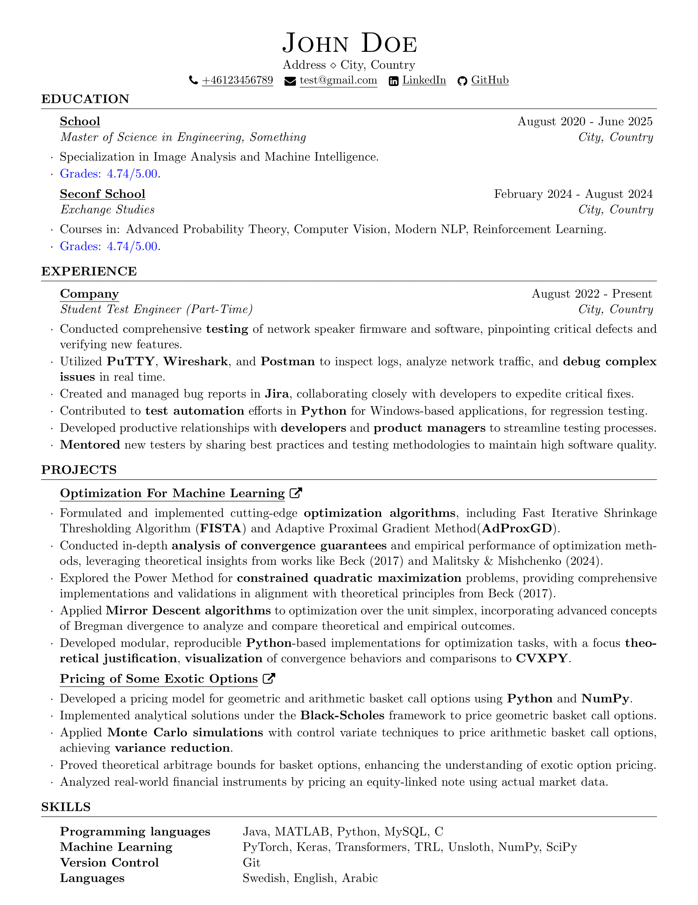

# Resume Builder

A LaTeX-based automated system for maintaining multiple versions of your resume with different project combinations. This tool solves a common problem in job applications: the need to customize your resume for different positions while keeping the content consistent and professional.

## Example Output

Here's a sample of what the generated resume looks like:



The tool generates multiple versions of this resume with different project combinations. For example, if you have three projects:
- Optimization For Machine Learning
- Pricing of Some Exotic Options
- EPFLLaMA (LLM Project)

It will generate:
- `output/Optimization_Pricing/YourName.pdf`
- `output/Optimization_LLM/YourName.pdf`
- `output/Pricing_LLM/YourName.pdf`
- `output/Optimization_Pricing_LLM/YourName.pdf`

## Why Use This?

When applying for different positions, you often want to highlight different projects based on their relevance to each role. For example:
- A machine learning position might need your ML projects
- A web development role might need your full-stack projects
- A research position might need your academic projects

Maintaining multiple versions of your resume manually can be tedious and error-prone. If you update one section (like your work experience or skills), you need to update it across all versions. This tool automates that process by:

1. Keeping your core information (education, experience, skills) in a single template
2. Storing each project as a separate file
3. Automatically generating all possible combinations of your projects
4. Building professional PDFs using LaTeX
5. Using GitHub Actions to automate the build process

This way, you can focus on writing great content while the tool handles the tedious work of maintaining multiple resume versions.

## 🌟 Features

- Automatically generates multiple PDF resumes with different project combinations
- Supports both combinations and permutations modes
- Uses LaTeX for professional-looking documents
- Automated builds via GitHub Actions
- Easy project management through simple LaTeX files

## 🚀 Getting Started

### Prerequisites

- Git
- GitHub account
- LaTeX installation (for local builds)
- Python 3.x (for local builds)

### Setup Instructions

1. Fork this repository:
   - Click the "Fork" button at the top right of this repository
   - Choose your account as the destination
   - If you want to protect your personal information, select "Private" for repository visibility
   
2. Clone your forked repository:
   ```bash
   git clone https://github.com/yourusername/Resume-Builder.git
   cd Resume-Builder
   ```

3. Set up GitHub Actions:
   - Go to your repository settings on GitHub
   - Navigate to Actions > General
   - Under "Workflow permissions", select "Read and write permissions"
   - Save the changes

4. Customize the template:
   - Edit `template.tex` with your personal information
   - Replace the details in the header (name, contact info, etc.)
   - Update the Education and Experience sections
   - Modify the Skills section as needed

5. Add your projects:
   - Create a new `.tex` file for each project in the `projects/` directory
   - Follow the format shown in the example `LLM.tex`
   - Each project file should contain a single `rSubsection` environment

6. Commit and push your changes:
   ```bash
   git add .
   git commit -m "Update resume content"
   git push
   ```

7. GitHub Actions will automatically:
   - Build all PDF combinations
   - Commit them to the `output/` directory
   - Push the changes back to your repository

8. Pull the generated PDFs:
   ```bash
   git pull
   ```

### Staying Updated with the Original Template

To get updates from the original template repository:

1. Add the original repository as upstream:
   ```bash
   git remote add upstream https://github.com/original-author/Resume-Builder.git
   ```

2. Whenever you want to pull updates:
   ```bash
   git fetch upstream
   git merge upstream/main
   ```

### Important Notes

- Consider making your fork private to protect personal information
- The first GitHub Actions workflow may need manual approval in your repository's Actions tab
- You can use [skip ci] in your commit message to prevent PDF generation
- Make sure to grant write permissions to GitHub Actions as described in step 3

### 📁 Repository Structure

```
Resume-Builder/
├── .github/workflows/
│   └── build.yml         # GitHub Actions workflow
├── projects/
│   ├── LLM.tex          # Example project
│   └── *.tex            # Your project files
├── output/              # Generated PDFs
├── template.tex         # Main resume template
├── resume.cls          # LaTeX class file
└── build.py            # Build script
```

## 🛠️ Configuration

### Build Modes

The builder supports two modes:

1. **Combinations** (default):
   - Generates PDFs for each unique combination of 2-3 projects
   - Order doesn't matter
   - Example: For projects A, B, C:
     - 2 projects: AB, AC, BC
     - 3 projects: ABC

2. **Permutations**:
   - Generates PDFs for each possible arrangement of 2-3 projects
   - Order matters
   - Example: For projects A, B, C:
     - 2 projects: AB, BA, AC, CA, BC, CB
     - 3 projects: ABC, ACB, BAC, BCA, CAB, CBA

### GitHub Actions Configuration

The build mode and PDF name can be configured in `.github/workflows/build.yml`:

```yaml
pre_compile: |
  MODE="permutations"      # "combinations" or "permutations"
  PDF_NAME="YourName.pdf"  # Name of generated PDFs
```

### Local Building

To build locally:

```bash
python build.py --mode combinations --pdf_name YourName.pdf
```

## 💡 Tips

- Use [skip ci] in your commit message to prevent GitHub Actions from building PDFs
- Pull after each build to get the latest PDFs

## 📝 Project File Format

Each project file in the `projects/` directory should be a `.tex` file containing a single project section. Here's an example from one of the sample projects:

```latex
\begin{rSubsection}
{\href{https://github.com/YourUsername/Project}{\underline{Optimization For Machine Learning} \href{Project Link}{\raisebox{-0.1\height}\faExternalLink }}}{}{}{}

\item Formulated and implemented cutting-edge optimization algorithms, including Fast Iterative Shrinkage Thresholding Algorithm (FISTA) and Adaptive Proximal Gradient Method(AdProxGD).
\item Conducted in-depth analysis of convergence guarantees and empirical performance of optimization methods.
\item Explored the Power Method for constrained quadratic maximization problems.
\item Applied Mirror Descent algorithms to optimization over the unit simplex.
\item Developed modular, reproducible Python-based implementations for optimization tasks.
\end{rSubsection}
\vspace{-8pt}  % Optional spacing adjustment
```

Key points about project files:
- Save each project as a separate `.tex` file in the `projects/` directory
- Format bullet points using `\item`
- Use LaTeX formatting for emphasis where needed (e.g., `\textbf{Python}`)


## 🤝 Contributing

Feel free to submit issues and enhancement requests!
